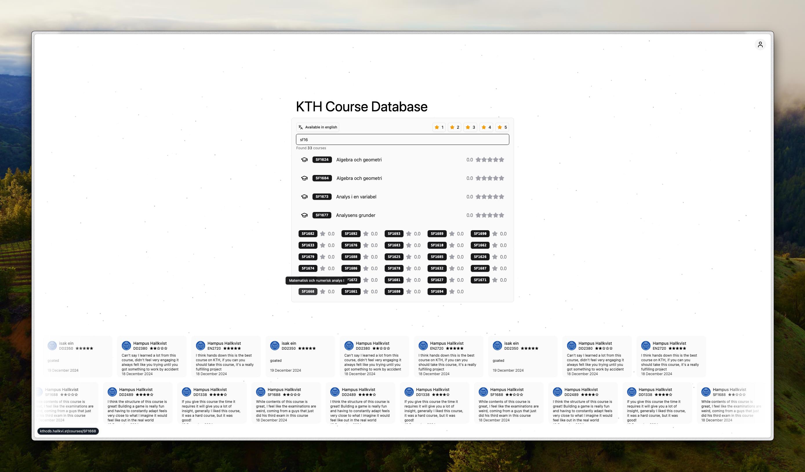

## KTHcdb

By: [Hampus Hallkvist](https://github.com/hampfh) and [Isak Einberg](https://github.com/einbergisak)

KTHcdb is a course database for kth, utilizing kths official api to fetch and search for courses, we run it through our own api where we also provide the service of letting users rate each course. It will then be possible for users get a better understanding of how liked a certain course is.

<!-- - What we've done up to this point
  We have built sign-up/sign-in pages (you can try these out by navigating to /signup and /signin, they are lacking some CSS at the moment), connected to our api for authorizing users through magic link and jwt. We have also connected the home page to kth's api to allow users to search for courses. Reviews and user ratings have **NOT** been implemented yet. -->

- File structure: Descriping the purpose of each file is not ergonomic on our case since we're using a code skeleton of greater size, how we have strucutred the project though is through the _/apps_ folder, separating the api and web part of the application. The web uses @tanstack/react-router, thus **the folder strucutres mimics the routes of the application**. As for the api, it similarly has a "routes" folder where the different api endpoints are exposed.

### 3rd party components

- Recharts for bar chart visualization (can be found on the course details page, showing rating distriution)
- Shadcn, our component library for the project, involves most user-visible components such as buttons, inputs, forms etc.
- MagicUI, built on top of shadcn ui. We use Marquee, Particles and Number Ticker.

### User reviews

[Prototype user test](./user-reviews/prototype-user-review.md)
[Formative eval user test](./user-reviews/formative-eval-stage-user-review.md)

### Apps and Packages

- `web`: a [React + Vite](https://vite.dev) app
- `api`: an [Elysia](https://elysiajs.com/) server
  - [Prisma ORM](https://www.prisma.io/), our object relationship manager for communicating with the database from the api.
  - [PostgreSQL](https://www.postgresql.org/) the actual database, storing data related to our application such as user reviews and cache.

### Utilities

This Turborepo has some additional tools already setup for you:

- [TypeScript](https://www.typescriptlang.org/) for static type checking
- [ESLint](https://eslint.org/) for code linting
- [Prettier](https://prettier.io) for code formatting
