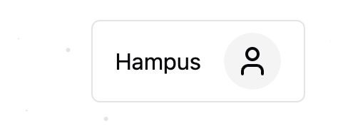
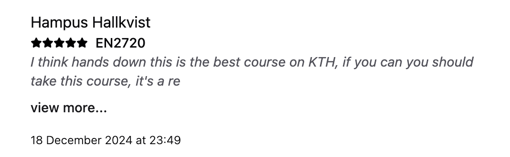
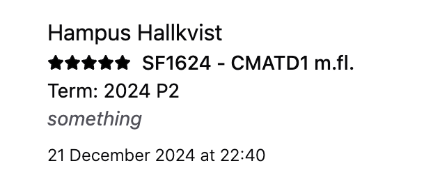

I did the user test with a non-kth student. When interacting with our page, they thought it was evident what the web application was about - a way to find information and reviews for KTH courses. They thought the UI was intuitive and interactive, and did not have any problems navigating.

One thing they thought was confusing was how to access your own profile page. At this point, we only had the login avatar on the home page, and it was only displayed as a small icon in the top right corner, even on large computer displays where it did not stand out and was very off to the side. We resolved this by adding the login avatar to the course page and profile page as well (letting you navigate to your own profile when visiting other profiles), and updating the avatar design to be larger and include the name of the user if they are on a larger screen, making it more visible and apparent.

## avatar

The other feedback was that it was confusing how course rounds or terms were not listed for the reviews - they suggested that the review dates do not provide enough information, as people might review the course years after they have completed it. We built upon this feedback by adding the course round/term to the review cards, to make the reviews more useful and improve the user experience. Also, it helps differentiate between reviews from users who have reviewed a course more than once (for example, if they have retaken it).

## reviewcard

